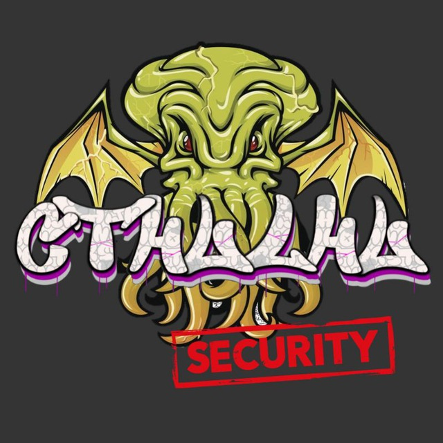

### Presentation Of The Community Cer0z Operations Access (COA)

`What is Cer0z Operati0ns Access? Or also known as "Un0z & C3r0z",
It is a community of the Telegram platform (Open Source) focused
on computer topics in general, Among them (Pentesting, Cryptography,
Networking, Computer Forensics, CTF, Programming, Red Team and Blue Team
among many more topics that abound there, this community has been a few months, 
Originally founded by DarlezSec. 
The idea of ​​creating Un0z & C3r0z arose from DarlezSec, to have a place where you can hang out with other users talking about computer science in general and be able to play CTF'S and King Of The Hill with the members and administrators.`
### Why should you join this Community?

* 1.- Group video call 3 times a week pentesting servers focused on CTF.

* 2.- Content on our Youtube channel solving CTF machines explaining step by step the pentesting methodology applied to solve the machine.

* 3.- Daily content in the Group Forum so that you advance in your level of knowledge.

* 4.- We do dynamics by administrator or moderator beating the founder of the group in KOTH (King Of The Hill).

