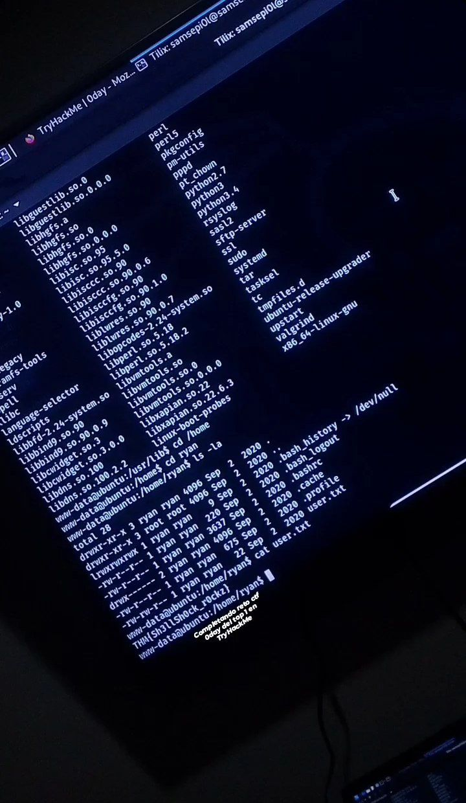

+++
author = "Darlez.Sec"
title = "Reto CTF 0day Nivel Medium Plataforma TryHackMe."
date = "2022-05-13"
description = "Metodologia que aplico en la CTF 0day de la plataforma TryHackMe."
tags = [
"Metodologias",
"My Mem0ri3s",
]
categories = [
"My Mem0ri3s",
"Metodologias",
]
series = ["Themes Guide"]
aliases = ["migrate-from-jekyl"]
image = "https://i.imgur.com/lCvqxKK.png"
+++
# Reto CTF 0day Nivel Medium, Plataforma TryHackMe.

`Reto Ctf 0day Plataforma TryHackMe.`
`Resumen: CTF 0day dónde se ven temas sobre explotación Shellshock para lograr hacer una reverse Shell, y usamos un exploit para la versión 3.13.0-32 de Ubuntu para escalar privilegios.`

`#ctf #Pentesting #tryhackme #Exploit #shellshock #0day #linux`
