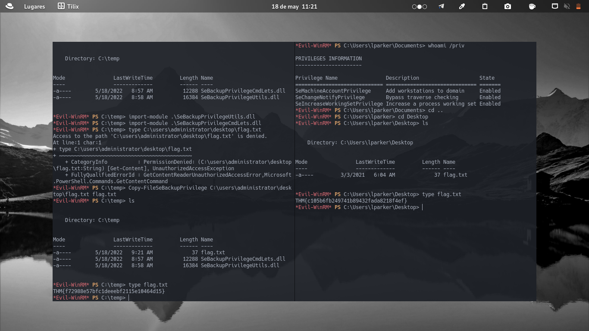

+++
author = "Darlez.Sec"
title = "Reto CTF Fusion Corp Nivel Hard, Plataforma TryHackMe"
date = "2022-05-18"
description = "Metodologia que aplico en la CTF Fusion Corp de la plataforma TryHackMe. "
tags = [
"mem0ri3s",
"metodologias",
]
categories = [
"mem0ri3s",
"metodologias",
]
series = ["Themes Guide"]
aliases = ["migrate-from-jekyl"]
image = "https://tryhackme-images.s3.amazonaws.com/room-icons/c7c5cbaebf5b3c858e7c37f4213ab6e1.jpeg"
+++	
# Ctf Fusion Corp Nivel Hard, Plataforma TryHackMe

`Metodología:  En esta CTF se vieron temas de Explotación a AD ( Active Directory ) y al SeBackupPrivilege, Se encontró un archivo de respaldo que contiene toda la información del usuario en el servidor web. Uno de los usuarios del archivo de copia de seguridad tiene la autenticación previa deshabilitada y el hash se decifro con John The Ripper y así con esas credenciales pudieron obtener una shell con Winrm como usuario lparker. Hicimos una Enumarecion con ldapdomaindump y en el archivo "domain_users.html" el usuario jmurphy tenía su contraseña en el campo de descripción del usuario y estaba en el grupo de operadores de respaldo que fue abusado para leer el indicador raíz y asi crearon un archivo copia de seguridad de la bandera del administrador.`
