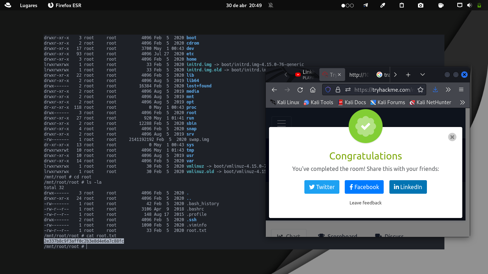

+++
author = "Darlez.Sec"
title = "Reto CTF GamingServer Platafroma TryHackMe, Nivel Easy."
date = "2022-05-13"
description = "Metodologia que aplico en la CTF GamingServer de la plataforma TryHackMe"
tags = [
"Metodologias",
"My Mem0ri3s",
]
categories = [
"Metodologias",
"My Mem0ri3s",
]
series = ["Themes Guide"]
aliases = ["migrate-from-jekyl"]
image = "https://tryhackme-images.s3.amazonaws.com/room-icons/80d16a6756c805903806f7ecbdd80f6d.jpeg"
+++
#### Reto CTF GamingServer, Nivel Easy Plataforma TryHackMe. 

`Metodología: Ctf se dónde se ven temas sobre escalacion de Privilegios en lxd,que es un administrador de contenedores y se usa para montar la carpeta raíz en máquina local, use alphine builder que es un script que proporciona una forma de crear imágenes de Alphine en Linux para poder montarlo usando LXD.`
