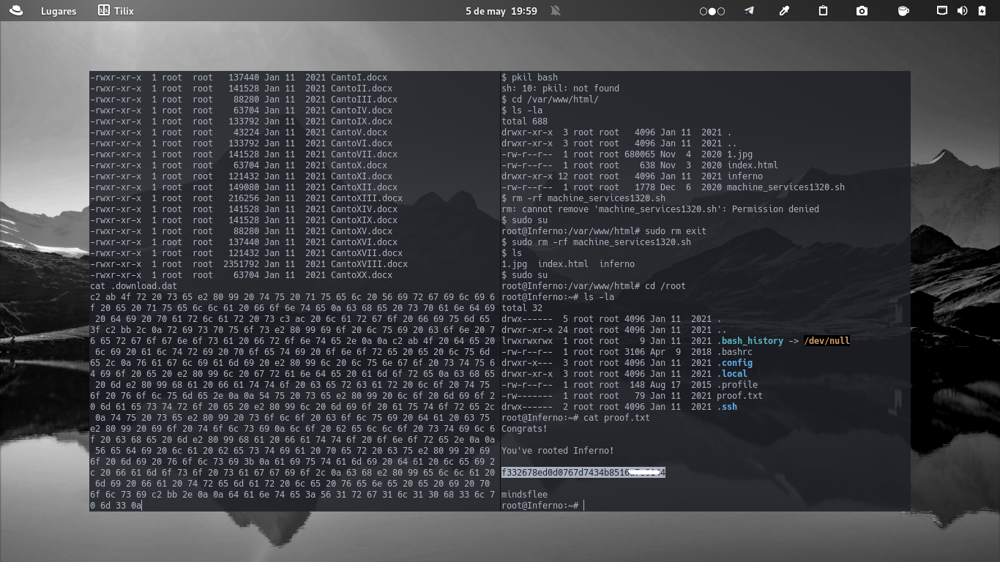

+++
author = "Darlez.Sec"
title = "Reto CTF Infero Nivel Medium, Plataforma TryHackMe"
date = "2022-05-13"
description = "Metodologia que aplico en la CTF Inferno de la plataforma TryHackMe."
tags = [
"Metodologias",
"Mem0ri3s",
]
categories = [
"Metodologias",
"Mem0ri3s",
]
series = ["Themes Guide"]
aliases = ["migrate-from-jekyl"]
image = "https://tryhackme-images.s3.amazonaws.com/room-icons/04838068cabd2452b322e06418cce864.png"
+++
### Reto CTF Inferno Nivel Medium, Plataforma TryHackMe.

`Ctf Inferno, Plataforma TryHackMe Nivel Medium`

`Metodología: CTF donde se ha usado un exploit para Codiac, lo que hace esta herramienta es ejecutar comando a nivel de sistema en Codiac para obtener una RevShell. En cuanto a la escalada de privilegios nos hemos aprovechado de la herramienta tee de Linux, la cual tenía permisos de ejecución a nivel sistema; de este modo se aprovecha la capacidad de escritura para poder modificar el archivo /etc/sudores agregando una línea la cual establece que el usuario dante puede realizar cualquier tipo de acción como un usuario con permisos elevados, hemos eliminado el archivo que estaba en el directorio /var/www/html/ llamado "machine_service1320.sh" que lo que hacía este script es que cerrara la sesión de todos los usuarios del sistema, y con eso pudimos mantener el acceso al sistema y obtener las últimas banderas.`
