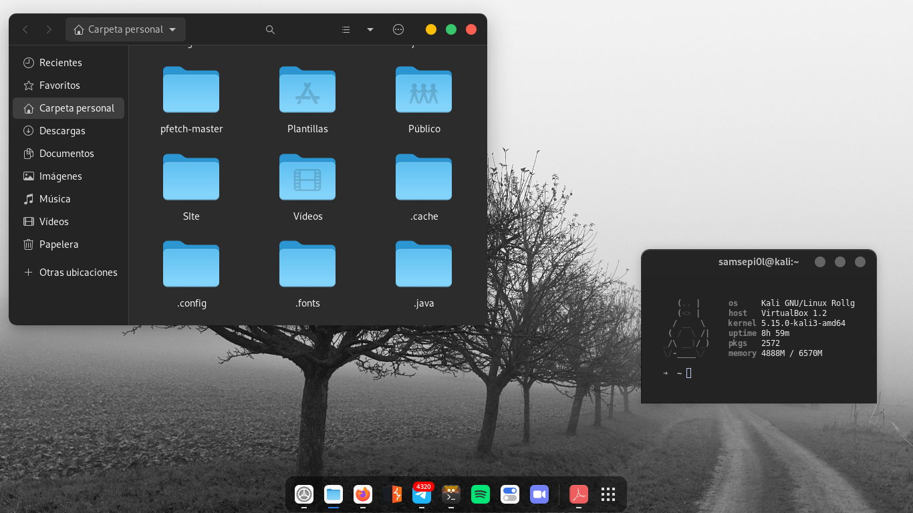

+++
author = "DarlezSec"
title = "My Desktop Environments"
date = "2022-05-25"
description = "a simple post to show my work environments and the progress I have made in them at the customization level."
tags = [
"ViernesDeEscritorio",
"Linux",
]
categories = [
"Linux",
]
series = ["Themes Guide"]
aliases = ["migrate-from-jekyl"]
image = "https://p4.wallpaperbetter.com/wallpaper/978/168/961/linux-microsoft-windows-wallpaper-preview.jpg"
+++
## Gnome 41.2 + Debian 11 + Colloid Dark

### Theme Colliod Dark

`Te ha gustado mi Entorno de Escritorio? ¿Quieres tenerlo igual? pasate por mi Github y tendras un tutorial bien explicado como tener tu entorno como el mio.`

[My Desks](https://github.com/DarlezSec/My-Desks/)
