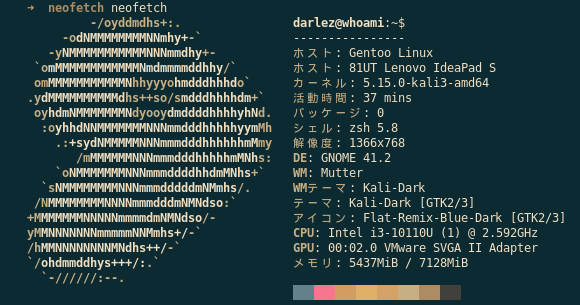
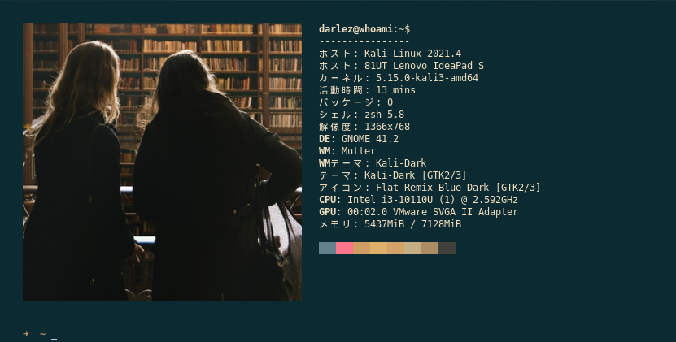
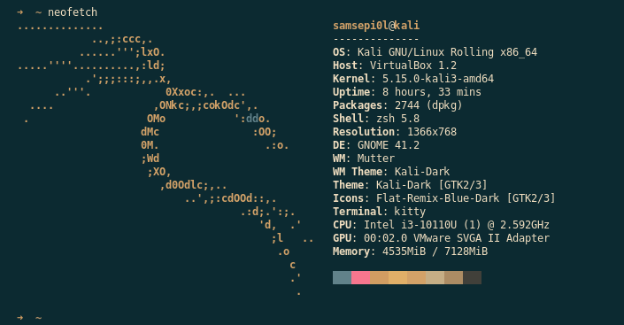
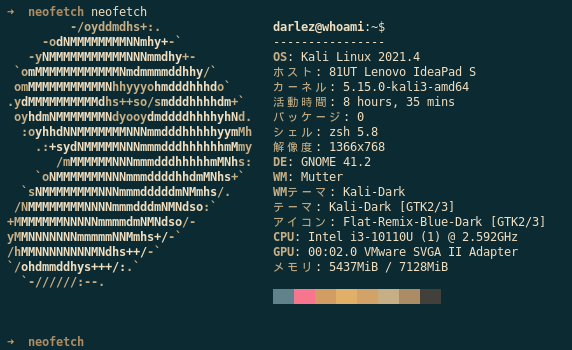
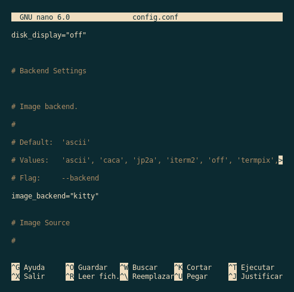
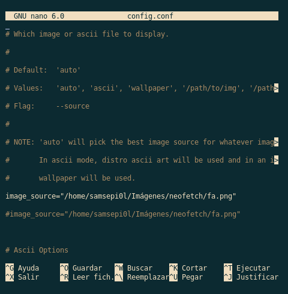

+++
author = "Darlez.Sec"
title = "Modificar y agregar valores a tu Neofetch"
date = "2022-05-19"
description = "Tutorial donde te enseñamos a gregar valores a tu neofetch y cambiar el texto ASCII a una imagen."
tags = [
"Tutoriales",
"Neofetch",
"Linux",
]
categories = [
"Tutoriales",
"Linux",
]
series = ["Themes Guide"]
aliases = ["migrate-from-jekyl"]
image = "neo.png"
+++
---
### Primero que nada, ¿Que es NeoFetch?


`Neofetch es una herramienta desarrollada en Bash que nos permite obtener información básica sobre el sistema instalado. Es la herramienta ideal para de un solo vistazo poder conocer que Ubuntu se ha instalado y sus características básicas. Para obtener información más completa, es necesario utilizar programas más completos.`

### Instalacion de Neofetch.

| Distribucion de Linux                  | Paquete de Instalacion     | 
|----------------------------------------|----------------------------| 
| Debian, Deepin, Kali Linux o derivados |  sudo apt install neofetch | 
| Arch Linux, Manjaro, Antergos          |  sudo yum -S neofetch      |        
|Fedora,RHEL, CentOS, Mageia o derivados | sudo pacman -S neofetch    |
| usuarios de Alpine Linux               |apk add neofetch            |


## ¿Como agregar valores a Neofetch?                                       



`Como ven aqui yo ya tengo los valores cambiados, entre ellos la imagen el titulo, componentes como el Host, Kernel, Paquetes etc..`

`la configuracion de nuestra aplicacion neofetch se guarda en un directorio octulto llamado ".config" en esta carpeta oculta normalmente se guardan los paquetes de tercera persona, entraremos con change directory cd .config haremos un ls y nos iremos al direcotorio llamado "neofetch" como vemos hay un archivo llamado ".config.conf" lo abriremos con "nano config.conf"  como ven aqui se encuentra  `


````bash
# See this wiki page for more info:

# https://github.com/DarlezSec/neofetch

print_info() {

    info title

    info underline


    info "OS" distro

    info "Host" model

    info "Kernel" kernel

    info "Uptime" uptime

    info "Packages" packages

    info "Shell" shell

    info "Resolution" resolution

    info "DE" de

    info "WM" wm

    info "WM Theme" wm_theme

    info "Theme" theme

    info "Icons" icons

    info "Terminal" term

    info "Terminal Font" term_font

    info "CPU" cpu

    info "GPU" gpu

    info "Memory" memory
 ````

`como ven aqui no esta nada configurado como el que yo tengo asi comenzaremos a imprimir el texto en las llamadas que hace, les dejare un ejemplo de como lo tengo yo ya editado`


````bash
# See this wiki page for more info:

# https://github.com/DarlezSec/neofetch

print_info() {

    prin "darlez@whoami:~$"

    info underline

    prin "OS" "Kali Linux 2021.4"

    prin "ホスト" "81UT Lenovo IdeaPad S"       

    info "カーネル" kernel

    info "活動時間" uptime

    prin "パッケージ" "0"

    prin "シェル" "zsh 5.8"

    info "解像度" resolution

    info "DE" de

    info "WM" wm

    info "WMテーマ" wm_theme

    info "テーマ" theme

    info "アイコン" icons

    info "ターミナル" "kitty"

    info "CPU" cpu

    info "GPU" gpu

    prin "メモリ" "5437MiB / 7128MiB"
 ````

`Basicamente este ejemplo demuestra que no hay que hacer mucho, solo cambiamos el info por un prin para imprimir el texto que queramos junto con el nombre y el resultado, ambos entre "" el idioma pues se lo cambie con google traductor, solo copie y pegue, si ustedes ven que deje el parametro info en unas con el nombre principal en otro idioma lo hago para que eso haga llamada hacia los parametros pero solo editamos el nombre principal, el resultado seguira siendo el mismo con el parametro "info" si es "prin" estarias imprimiendo el texto que vayas a querer, un ejemplo yo quier que imprima que tengo un Host prin "ホスト" "81UT Lenovo IdeaPad S" y ese sera el texto que se mostrara al ejecutar  "neofetch" si lo hacemos con el parametro "info" lo que hara sera hacer una llamada al parametro y dar el Host que en realidad tengas, esto fue un ejemplo para que entiendad lo que hace cada parametro.. `

## Antes 


## Despues 

 
## Cambiar el texto ASCII a una imagen,

`para esto tendremos que usar la terminalde Kitty pero tranquilo que aqui te enseñaremos a customizarla para que te quede de pana :D, primero que nada volveremos a abrir el archivo "config.conf"  nos iremos casi hasta abajo hasta el apartado llamado " # Image Backend"  y en la parte donde dice image_backend="" entre las comillas escribiremos kitty, algo asi te tuvo que quedar`



`ahora nos iremos al apartado llamado " # Image Source" nos iremos a la parte donde dice ( image_source="/home/samsepi0l/Imágenes/neofetch/fa.png" ) en esta parte no ira obviamente esta ruta, aqui ira la ruta en donde se encuentre la imagen que quieren poner en su neofetch, tambien en la parte de abajo llamada igual solo que con un 
( # ) ahi tambien ira la misma ruta que colocaron anteriormente, de igual manera si no van entendiendo les deja una demostracion de como les deberia de quedar`



`ahora nos falta instalar la terminal de "Kitty les dejare unas columnas con los paquetes para la mayoria de ditribuciones de Linux`

| Distribucion de Linux                  | Paquete de Instalacion     |
|----------------------------------------|----------------------------|
| Debian, Deepin, Kali Linux o derivados |  sudo apt install kitty    |
| Arch Linux, Manjaro, Antergos          |  sudo yum -S kitty         |        
|Fedora,RHEL, CentOS, Mageia o derivados | sudo dnf install kitty     |
| usuarios de Alpine Linux               |apk add kitty               |
| Usuarios de Ubuntu                     | sudo apt-get install kitty |
  

`ya dentro de la terminal de Kitty clonaremos mi repositorio donde tengo toda mi configuracion de mi terminal.`

### Instalacion de mi configuracion de Kitty

`git clone https://github.com/DarlezSec/kitty.conf.git`

`cd kitty.conf`

`mv color.ini kitty.conf /home/samsepi0l/.config/kitty`

`con esto listo procedamos a cerrar la terminal y volver a abrirla, escribimos neofetch y este seria el resultado.`


### Como edito el color de mi terminal Kitty?

`nos iremos a la ruta /home/samsepi0l/.config/kitty/ y haremos un "nano kitty.conf" en la parte de hasta abajo llamada "foreground" es para el color de la letra principal, el
"background" es para el color de la terminal para editar la fuente deberas ya tener el tu directorio .fonts tu fuente ya instalada asi que en "font_family" quitaran la mia y escribiran el nombre de la fuente que ustedes tenga por preferencia, para el tamaño de la fuente eso se modifica en "font_size" y ponen el numero de que tan grande quieren que este su fuente, ahora para el color de las carpetas,imagenes etc nos iremos a el archivo "color.ini" lo abriran con nano como siempre y veremos una lista de bastantes colores, ustedes podran ir jugando con los colores a su preferencia, a unos apartados les he dejado unos que otros nombres raros pero no tiene importancia, ustedes solo vayan jugando con los colores y averiguando cual quieren cambiar y cual no, con es concluiria el tutorial de hoy, si llegan a tener algun error sobre el neofetch pueden irse a mi github` [Github Neofetch](https://github.com/DarlezSec/neofetch/) `y solo copiar mi archivo config.conf y añadirlo en el directorio /home/samsepi0l/.config/neofetch/, si tienen alguna duda recuerden que me pueden contactar por privado en mi telegram personal` [@Samsepi0l](https://t.me/samsepiol) `normalmente siempre estoy activo, espero les haya servido de algo y nos vemos.`
