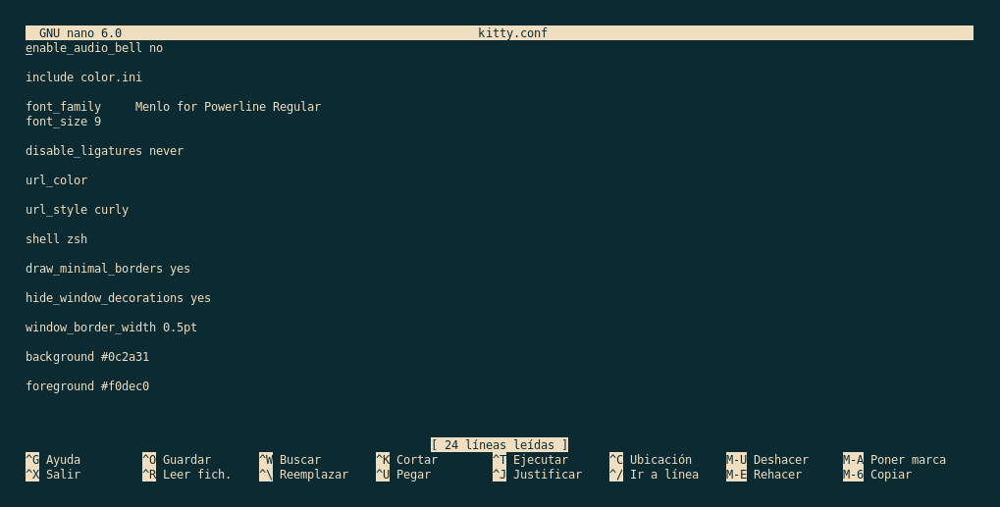

+++
author = "Darlez.Sec"
title = "Modificar y agregar valores a tu Neofetch"
date = "2022-05-19"
description = "Tutorial donde te enseñamos a gregar valores a tu neofetch y cambiar el texto ASCII a una imagen."
tags = [
"Tutoriales",
"Neofetch",
"Linux",
]
categories = [
"Tutoriales",
"Linux",
]
series = ["Themes Guide"]
aliases = ["migrate-from-jekyl"]
image = "neo.png"
+++
---
### Primero que nada, ¿Que es NeoFetch?

`Neofetch es una herramienta desarrollada en Bash que nos permite obtener información básica sobre el sistema instalado. Es la herramienta ideal para de un solo vistazo poder conocer que Ubuntu se ha instalado y sus características básicas. Para obtener información más completa, es necesario utilizar programas más completos.`

### Instalacion de Neofetch.

| Distribucion de Linux                  | Paquete de Instalacion     | 
|----------------------------------------|----------------------------| 
| Debian, Deepin, Kali Linux o derivados |  sudo apt install neofetch | 
| Arch Linux, Manjaro, Antergos          |  sudo yum -S neofetch      |        
|Fedora,RHEL, CentOS, Mageia o derivados | sudo pacman -S neofetch    |
| usuarios de Alpine Linux               |apk add neofetch            |

## ¿Como agregar valores a Neofetch?                                       

`Como ven aqui yo ya tengo los valores cambiados, entre ellos la imagen el titulo, componentes como el Host, Kernel, Paquetes etc..`

`la configuracion de nuestra aplicacion neofetch se guarda en un directorio octulto llamado ".config" entraremos con change directory cd .config haremos un ls y nos iremos al direcotorio llamado "neofetch" como vemos hay un archivo llamado ".config.conf" lo abriremos con "nano config.conf"  como ven aqui se encuentra `

